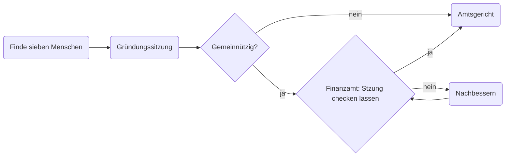
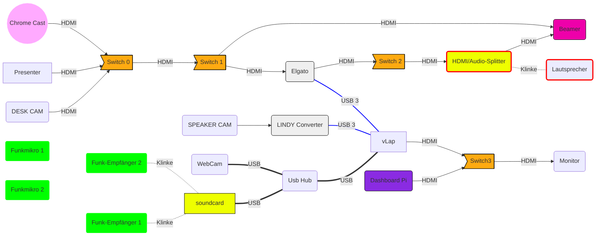

# Open Verein
Wie du deinen Verein gründest und weitere coole und wichtige Infos. Wir freuen uns über [Issues](https://github.com/chaostreff-flensburg/openverein/issues) oder [Pull Requests](https://github.com/chaostreff-flensburg/openverein/pulls) mit Verbesserungen.

Satzung und Beitragsordnung vom [Chaostreff Flensburg e.V.](https://chaostreff-flensburg.de/mitmachen/satzung/)

**Disclaimer:** Wir übernehmen keine Haftung für Richtigkeit des Inhalts, freuen uns aber über Verbesserungen und Tipps!

## Vereinsgründung
### Was wird alles für die Gründung von einem Verein gebraucht
- Sieben Menschen für die Gründungsversammlung ([§ 56 BGB](https://www.gesetze-im-internet.de/bgb/__56.html))
- Satzung / Beitragsordnung
- Sitz und eine Post Anschrift
- Mindestens einen Menschen für die Vorstandsarbeit (üblicherweise aber mindestens 3) ([§ 26 Abs. 1 Satz 2 BGB](https://www.gesetze-im-internet.de/bgb/__26.html))
- Geld für die Eintragung (ca. 130€)
- Ordner für die Bürokratie

### Was ist auch noch gut zu haben
- Mitgliedsformulare für Beitritt
- System zur Verwaltung von Mitgliedschaften und der Mitgliedsbeiträge
- Bankkonto. Das bekommt ihr entweder bei eurer Lokalen Sparkasse oder Online bei der [GLS Bank](https://www.gls.de/gemeinnuetzige-kunden/)
- Website um Satzung, Protokolle, Formulare zu veröffentlichen (und natürlich zur Öffentlichkeitsarbeit)
- Email Adresse: Für etwaigen Kontakt zu Mitgliedern oder dem Notar

### Was muss in eine Satzung
- Vereinsname
- Ort des Vereinssitzes z.B. Flensburg
- Vereinszweck (auch wichtig für die Gemeinnützigkeit)
- Mitgliedschaft im Verein
- Beitragsordnung oder ein Verweis auf eine externe Beitragsordnung
- Regelungen für den Vorstand
- Regelungen für die Mitgliederversammlung
- Regelungen zum Eintrag und Auflösung des Vereins

### Wie schreibe ich eine gute Vereinssatzung?
Am besten siehst du dir Satzungen von Vereinen an die etwas machen wie dein geplanter Verein an. Dabei sollte auch darauf geachtet werden ob die Satzungen zu Vereinen gehören die gemeinnützig sind.

### Beitragsordnung (in der Satzung)
Die Satzung muss nach jeder Änderung neu eingetragen werden und das ist jedes mal Geld & Arbeit verbunden. Deswegen haben wir unsere Beitragsordnung von unserer Satzung separiert. Die Beitragsordnung legt fest, wie hoch der Mitgliedsbeitrag für den Verein ist und welche verschiedenen Beiträge es gibt. Rechnet am besten vorher durch wie hoch eure Kosten sind und legt danach den Mitgliedsbeitrag fest. Am besten gibt es auch einen Mitgliedsbeitrag welcher reduziert ist.

### Vereinsname
Beim Vereinsnamen seit ihr total frei, dürft euch aber natürlich nicht wie ein anderer Verein, etc... benennen. Wir haben uns für den Namen Chaostreff Flensburg entschieden weil es dieses Namensmuster schon im CCC-Umfeld gibt und einfach so verwendet werden kann.

### Adresse oder Anschrift vom Verein
Dieser kann auch eine Privat Adresse sein. Wichtig ist nur das dort Post zugestellt werden kann und diese Briefe weiter an den Verein geleitet werden. Die Adresse ist vor allem wichtig für Dokumente vom Notar, Amtsgericht und gegebenenfalls Finanzamt.

### Notar Finden
Da Notare feste Sätze für ihre Arbeit bekommen unterscheiden sich die Notare nicht wirklich im Preis. Wir haben unseren aufgrund der Entfernung ausgewählt. Ihr könnt auch den Notar bei jeder Eintragung wechseln, das führt höchsten zu ein wenig mehr Arbeit weil dort die Daten vom Vorstand und Verein noch nicht hinterlegt sind.

## Fun Facts:
### Die Abkürzung e.V.
Die Abkürzung e.V. ist für einen eingetragenen Verein nicht als offizielle Abkürzung festgeschrieben. Deswegen gibt es auf Amrum (dort wird auch Friesich gesprochen) den Öömrang Ferian i. f., für iindraanj ferian. Kopiert und Quelle: [Wikipeida](https://de.wikipedia.org/wiki/Verein#Eingetragener_Verein)

Quellen und weitere Materialien: http://www.vereinsknowhow.de/kurzinfos/leitfaden.htm
Kontakt: kontakt @ samuelbtrinkmann.de
